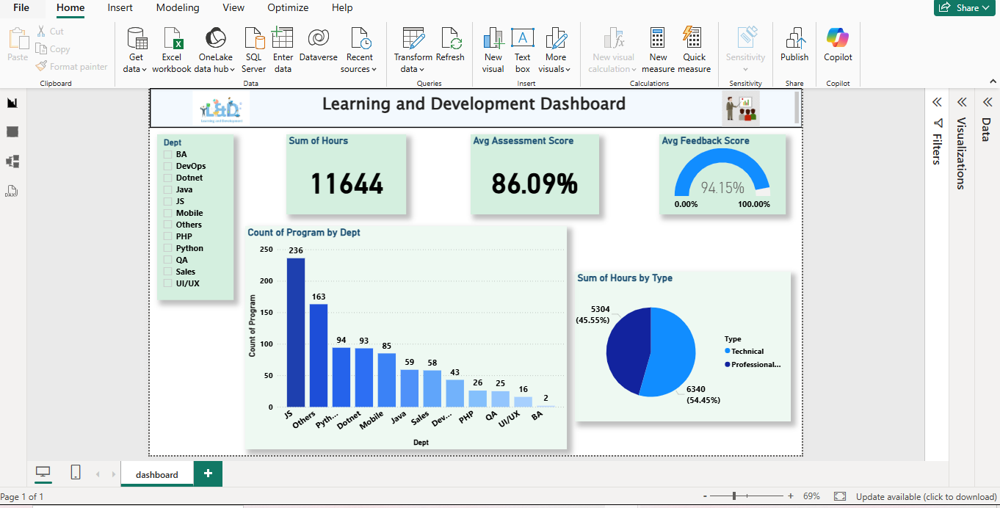

# neosoft-dashboard-showcase

# Learning & Development Dashboard (NeoSOFT Technologies Internship)

## Overview
Built an interactive Power BI dashboard to track training program engagement and
effectiveness across 12 departments during my Python Internship at NeoSOFT Technologies
(Jul 2025 – Sep 2025).

## Key Metrics Tracked
- **11,644+** total training hours across 12 departments
- **86.09%** average assessment score
- **94.15%** average feedback score
- Technical vs Professional program hour split: **45.55% / 54.45%**

## Features
- Department-wise drill-down filter (BA, DevOps, Dotnet, Java, JS, Mobile, PHP, Python,
  QA, Sales, UI/UX, and others)
- KPI cards for total hours, average assessment score, and average feedback score
- Program distribution by department (bar chart) — JS, Others, and Python show the
  highest program counts
- Training type breakdown (donut chart) — Technical vs Professional program hours

## Dashboard

## Note on Data
This dashboard was built using internal company training data as part of my internship.
The underlying dataset and `.pbix` file are not shared here due to confidentiality; this
repository showcases the dashboard design, structure, and my role in building it.

## Tools Used
Power BI — Data Modelling, DAX, KPI Cards, Drill-down Filters, Data Cleaning, ETL

## Author

**Greeshma Rao**
Data Analyst | Pursuing M.Sc. Data Science, University of Mumbai
